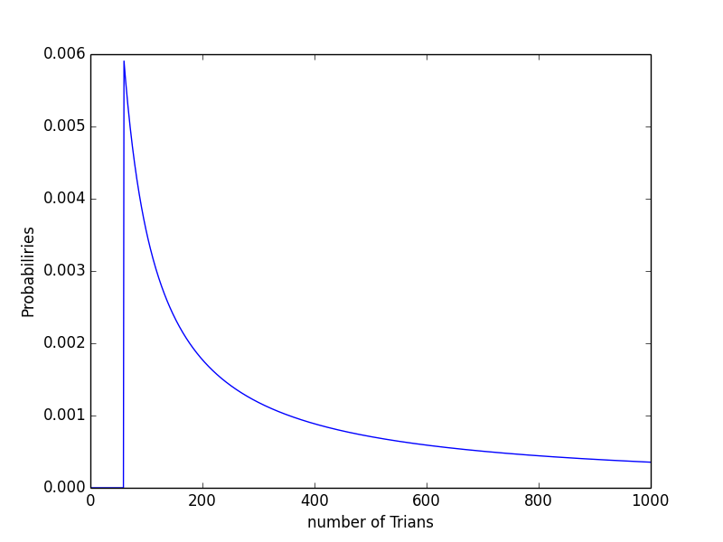

# Machine Learning


## 1. Bayesian
### 1.1 Basical Introduction 
#### 1.1.1 Cookie problem
Commonly, when calculating probabilities of a specific event occurrence, we will come out its prior possibilities quickly. However, the answer is wrong in a lots of cases. For instance, there are two bowls and each of them contain two kinds of cookie, chocolate and vanilla.

|        | Bowl 1 | Bow2 |
| --------- | ------ | ---- |
| Chocolate | 20 | 10 |
| Vanilla   | 20 | 30 |
 
**if we randomly chose a bowl and take out a vanilla cookies, what is the probabilities of the event that we take out the vanilla from bowl 1?**

Simply, we will thinks, well, it's definitely 1/2.
Yes, the prior probabilities is exactly 1/2. we have half chance to choose bow1. Given that we have already known that the cookies we take out is chocolate cookies, we must take it into consideration when we answer the question.

So here is how I thought:

- we have half chance to choose each bowl: 

	*P(bow1)=1/2*
- Take out vanilla chocolate from bow1: 

	*P(bow1 | vanilla)=1/2*
- Take out vanilla chocolate from bow2: 

	*P(bow2 | vanilla)=1/4*
- Take out vanilla chocolate: 

	*P(vanilla)=P(bow1 | vanilla) + P(bow2 | vanilla)=3/4*
- **As P(A)P(A|B)=P(B)P(B|A) (if A and B are independent, bayesian)**
- **P(vanilla)P(vanilla | bow1)=P(bow1)P(bow1 | vanilla)**
- **P(vanilla | bow1) = (1/2 * 1/2) / (3/4) = 1/3**

And here is my python code:

```python
class Cookie(basic.Suite):
    def __init__(self,hypothesis):
        basic.Suite.__init__(self,hypothesis)
        ## at first, input information
        self.data_cookie = {"Bow 1":dict(vanilla=30,chocolate=10),
                            "Bow 2":dict(vanilla=20,chocolate=20)
                            }
		## then construct prior probability: 
		## each bowl is equally chosen
    def priorDistr(self,hypothesis):
        for hypo in hypothesis:
            self.PriorProb(hypo,1)
		
		## P(bow2 | vanilla) and P(bow1 | vanilla)
    def Likelihood(self,hypo,ins):
        like = self.data_cookie[hypo][ins]
        return like
```
#### 1.1.2 Train and  Euro Problem
Previously, we have talked about prior probabilities and post probabilities. In this chapter, we are going to discuss prior distribution.

**Think about this question:**

*if trains in trail were named from 1 to N, you could see a train named 60. Please estimate how many trains in trail?*

Based on the observation, we can apply bayesian theory to solve this problem:

- we hypothesis that the number of trains is equally occurred in trails. It means that P(1)=P(2)=...=P(N)= 1/n

- Based on a given number, we can calculate the probabilities that number 60 to be seen.
	- if the number of trains below 60, we cannot see number 60.
	- if the number of train above or equal to 60, the  probabilities we see number 60 is 1/(number  of trian)

- we can, at first, hypothesize that it may range from 1 to 1000

And here is my code:

```python
class Train(basic.Suite):
    def __init__(self,hypothesis):
        basic.Suite.__init__(self,hypothesis)
    # based on uniform distribution
    ## the number of trains distribute uniformly.
    def priorDistr(self,hypothesis):
        for hypo in range(1,hypothesis + 1):
            self.PriorProb(hypo,1)
    # based on given number of trains 
    ## update the chance that number 60 to be seen
    def Likelihood(self,hypo,ins):
        if hypo < ins:
            return 0
        else:
            return 1.0/hypo
```

we can print its post probabilities discribution: 
 
